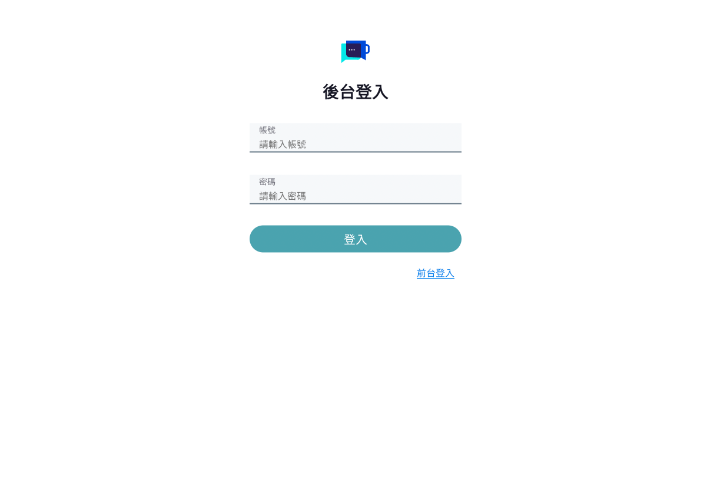
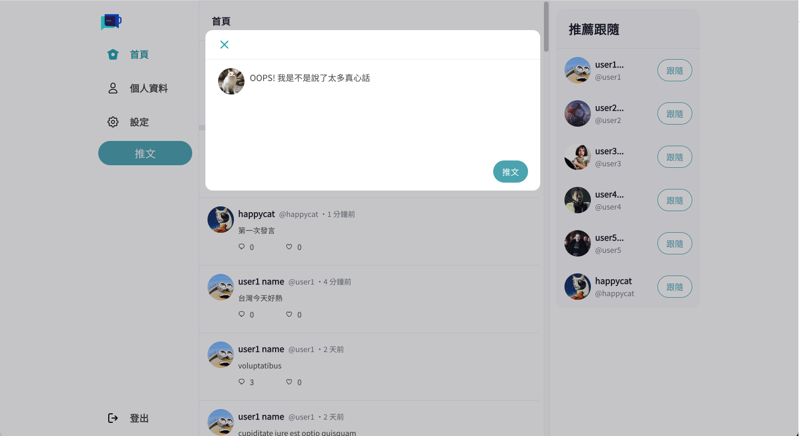
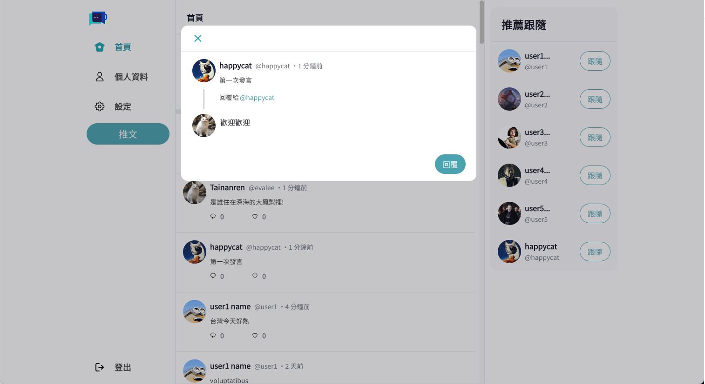
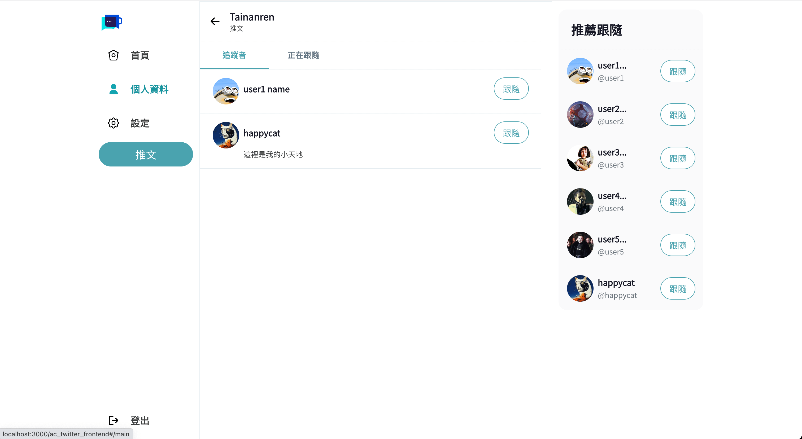
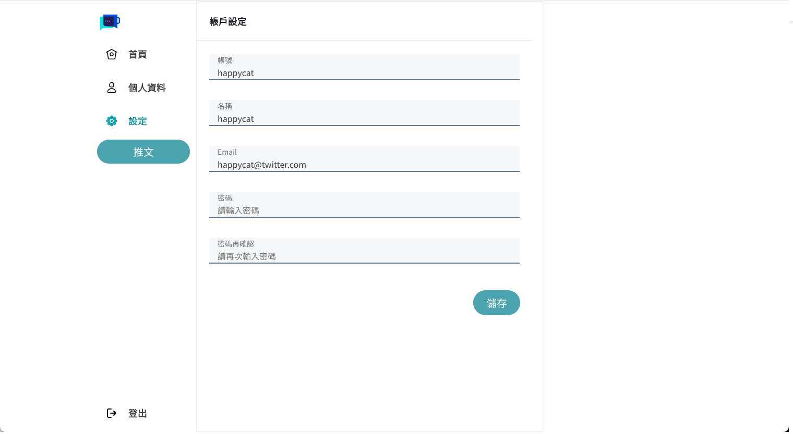

# CoffeeTalk-frontend

- A simplified version of twitter platform using a frontend-backend separation approach.
- using React, SASS, Bootstrap-grid,react-hook-form...etc.

## Features

User

- Login and log out
- Register a new account
- View all tweets
- Compose tweets and create new posts
- Reply to tweets by clicking the reply icon
- Like tweets by clicking the heart icon
- Review other user's profile
- Click on a user's avatar to view their profile information, tweets, replies, and liked tweets
- Click the follow button to start following a user
- View the current list of followers and following users
- Edit personal profile and modify the avatar, background, name, and bio
- Click settings page from nav to modify account details such as username, email, and password

Admin

- Login
- View a list of all users
- View all tweets and have the ability to delete posts that do not comply with the rules from the backend.

## Screenshots

- User login
<table>
  <tr>
    <td colspan="2">test account </td>
  </tr>
   <tr>
    <td><b>account</b></td>
    <td>user1</td>
  </tr>
    <tr>
    <td><b>password</b></td>
    <td>12345678</td>
  </tr>
</table>


- Register a new account
  

- Admin login
<table>
  <tr>
    <td colspan="2">test account </td>
  </tr>
   <tr>
    <td><b>account</b></td>
    <td>root</td>
  </tr>
    <tr>
    <td><b>password</b></td>
    <td>12345678</td>
  </tr>
</table>



- Main page to view all the tweets
  

- Compose tweets and create new posts
  

- Reply a tweet
  

- Like a tweet by clicking the heart icon
  

- Click on a user's avatar to view their profile information, tweets, replies, and liked tweets
  

- Click the follow button to start following a user
  

- Click on "Following" or "Followers" to view the current list of followers and following users
  
  

- Edit personal profile and modify the avatar, background, name, and bio
  

- Click settings page from nav to modify account details such as username, email, and password
  

- View all tweets from admin side and have the ability to delete posts that do not comply with the rules from the backend.
  

- View a list of all users from the admin side
  

## Prerequisites

- Node.js 14.16.0
- React 18.2.0
- Sass 1.62.1

## Other Dependencies

- axios 0.27.2
- bootstrap 5.3.0
- react-hook-form 7.44.3
- jsonwebtoken 9.0.0
- clsx 1.2.1
- gh-pages 4.0.0
- sweetalert2 11.7.12
- dayjs 1.11.8

## Install and Execution

1. Please ensure you have downloaded Node.js and npm.
2. Clone the project to your local and using the following command in the terminal:
   `git clone https://github.com/leemengyun/ac_twitter_frontend.git`
3. Install the node_modules by running the following command in the terminal:

```
  npm install
```

4. Start the project by entering the following command in the terminal:

```
  npm start
```

5. Open your browser and go to http://localhost:3000/#/login ,then you'll see the login page.
6. Use the following credentials to log in to the frontend or backend:

- User login: Username: user1, Password: 12345678
- Admin login: Username: root, Password: 12345678

7. To stop the project, enter the following command in the terminal:
   `ctrl+c`

## Project Team Members

Frontend - Eva Lee, Keifer
Backend - Sam Lu, 林哲哲
